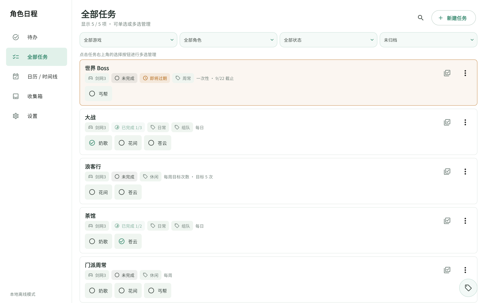
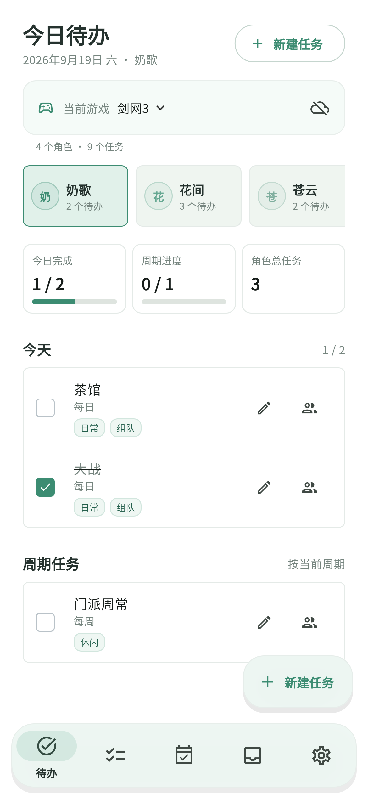

<div align="center">
  

  # 角色日程

  **为多游戏、多角色玩家设计的离线任务与日程管理工具**

  把不同游戏、不同角色的日常、周常和阶段目标放在一个清爽的时间表里。

  [](https://github.com/cyan77/jx3_tasks/releases/latest)
  [](https://github.com/cyan77/jx3_tasks/actions/workflows/release-windows.yml)
  
  

  [下载最新版](https://github.com/cyan77/jx3_tasks/releases/latest) · [查看更新记录](https://github.com/cyan77/jx3_tasks/releases) · [反馈问题](https://github.com/cyan77/jx3_tasks/issues)
</div>

---

## 界面预览

<table>
  <tr>
    <td width="66%" valign="top">
      
      <p align="center"><sub>桌面端 · 全部任务、状态与角色进度</sub></p>
    </td>
    <td width="34%" valign="top">
      
      <p align="center"><sub>手机端 · 今日待办与周期进度</sub></p>
    </td>
  </tr>
</table>

## 为什么使用角色日程

当游戏和角色越来越多，任务往往散落在登录界面、备忘录和脑海里。角色日程以“游戏 → 角色 → 任务”为主线，让你快速知道：**今天还有谁没做、当前周期还差多少、哪些任务暂时不需要分配。**

| 🏠 今日待办 | 🗂️ 全部任务 | 📅 日历时间线 |
| --- | --- | --- |
| 只展示仍有未完成任务的角色，快速勾选今日与周期任务 | 从游戏、角色、状态和标签等维度查看整体任务情况 | 按日期查看任务安排，宽屏下可直接勾选子任务 |
| 📥 收集箱 | 👥 多角色管理 | ☁️ 同步与备份 |
| 先记录、后整理；任务未分配角色也不会丢失 | 同一任务可分配给多个角色，各自保留独立进度 | 支持坚果云 WebDAV、版本化云端备份和本地 JSON 备份 |

## 核心功能

### 多游戏与多角色

- 在多个游戏之间快速切换，分别维护角色与任务。
- 角色支持新建、编辑、归档、恢复、删除和批量管理。
- 首页按当前游戏汇总**仍有未完成任务的角色数与任务数**。
- 同一个任务可一次分配给多个角色，每个角色独立记录完成状态。

### 灵活的任务周期

- 支持一次性、每日、每周、每月任务。
- 支持每周 / 每月目标次数，例如“本周完成 3 次”。
- 周任务可以指定星期，也可以作为本周任意时间完成的目标。
- 可设置开始日期、截止日期、备注和子任务。
- 二元任务的全部子任务完成后，主任务会自动完成；取消子任务时同步恢复。

### 标签与快速筛选

- 每个任务可以添加多个标签，可新建标签或复用已有标签。
- 标签会显示在首页、日历、收集箱和全部任务中。
- 全部任务右下角提供标签按钮，点击后以动画向上展开 `#标签`。
- 支持同时选择多个标签，再次点击即可取消筛选。
- 搜索可同时匹配任务名称、内容与标签。
- 任务在分配、复制、同步编辑或移入收集箱时会保留标签。

### 收集箱与批量整理

- 想到任务时可以先放入收集箱，不必立即选择角色或周期。
- 收集箱任务支持继续编辑、设置周期，再分配给一个或多个角色。
- 长按进入多选模式，可批量分配、归档或删除。
- 全部任务同样支持长按多选，并通过底部操作栏集中处理，列表不会因进入编辑模式而跳动。

### 日历、进度与主题

- 首页集中显示今日完成、周期进度和角色总任务。
- 日历 / 时间线同时展示多个游戏的任务，并支持按游戏筛选。
- 桌面宽屏可在日历中直接操作子任务；手机端保持紧凑展示。
- 支持浅色、深色和跟随系统主题。
- 弹窗、编辑器、下拉菜单与日期选择器采用统一的轻磨砂视觉。

### 离线优先与数据安全

- 所有数据默认保存在本机，无需注册账号即可使用。
- 支持坚果云 WebDAV 手动上传、自动同步和从历史备份恢复。
- 云端采用版本化备份，保留最近 10 份，避免不同设备直接互相覆盖。
- 支持本地 JSON 导入 / 导出，游戏、角色、任务和完成记录可整体迁移。
- 新版本兼容旧数据与历史备份。

## 下载与安装

前往 [Releases](https://github.com/cyan77/jx3_tasks/releases/latest) 下载最新版：

| 平台 | 下载文件 | 说明 |
| --- | --- | --- |
| Android | [RoleSchedule-Android.apk](https://github.com/cyan77/jx3_tasks/releases/latest/download/RoleSchedule-Android.apk) | 下载后允许浏览器安装未知来源应用 |
| Windows | [RoleSchedule-Windows-x64.zip](https://github.com/cyan77/jx3_tasks/releases/latest/download/RoleSchedule-Windows-x64.zip) | 解压后运行应用程序，请勿只复制单个 EXE |
| macOS | [RoleSchedule-macOS.dmg](https://github.com/cyan77/jx3_tasks/releases/latest/download/RoleSchedule-macOS.dmg) | 打开 DMG 后将应用拖入“应用程序” |

> 数据默认只保存在当前设备。首次跨设备使用前，建议先在“同步与备份”中导出本地备份，或配置坚果云 WebDAV。

## 快速上手

1. 添加或选择一个游戏。
2. 为游戏建立角色，也可以先跳过这一步。
3. 新建任务并设置周期、日期、标签与子任务。
4. 将任务分配给角色；暂时不确定的任务先放入收集箱。
5. 每天从首页勾选待办，在日历和全部任务中查看整体进度。
6. 在“设置 → 同步与备份”中配置坚果云或导出本地备份。

## 坚果云 WebDAV

应用使用坚果云 WebDAV 保存版本化备份。配置时请填写坚果云生成的**应用密码**，不要使用网页登录密码。

- 未配置时，首页同步按钮会直接进入配置页面。
- 配置完成后，可手动上传、刷新备份列表、恢复指定版本或开启自动同步。
- 恢复云端备份会替换当前本地数据；重要操作前建议先导出本地备份。

## 从源码运行

需要 Flutter `3.47.4` 或兼容版本。

```bash
flutter pub get
flutter run
```

指定桌面平台：

```bash
flutter run -d windows
flutter run -d macos
```

提交前检查：

```bash
flutter analyze --no-fatal-infos
flutter test
```

<details>
<summary><strong>项目结构</strong></summary>

```text
lib/
├── main.dart                 # 启动页与本地数据加载
├── app.dart                  # 应用、全局状态与主题入口
├── models/task_models.dart   # 游戏、角色、任务、周期与日期模型
├── data/
│   ├── local_store.dart      # 本地数据与 JSON 备份
│   ├── sync_service.dart     # WebDAV 同步与版本化备份
│   └── theme_settings.dart   # 主题设置持久化
├── state/app_state.dart      # 业务状态、任务操作与同步流程
├── theme/app_theme.dart      # 浅色 / 深色与磨砂视觉
└── ui/
    ├── home_shell.dart       # 桌面侧栏 / 手机底部导航
    ├── task_editor.dart      # 任务创建、编辑与分配
    ├── game_editor.dart      # 游戏创建与编辑
    ├── screens/              # 首页、任务、日历、收集箱、角色与设置
    └── widgets/common.dart   # 通用卡片、任务与进度组件
```

</details>

## 参与改进

欢迎通过 [Issues](https://github.com/cyan77/jx3_tasks/issues) 提交问题或功能建议。反馈界面问题时，附上设备型号、系统版本和截图会更容易定位。

---

<div align="center">
  <sub>角色很多，日程也可以井井有条。</sub>
</div>
